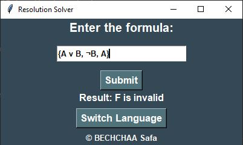

# Resolution Algorithm 
# Introduction

This Python program provides a resolution solver implemented with a graphical user interface using Tkinter. The solver utilizes the resolution algorithm to determine the validity of a logical formula provided by the user.

The resolution algorithm is a method used in propositional logic to determine whether a given formula is logically valid. It works by attempting to derive the empty clause (a contradiction) from a set of clauses representing the negated form of the formula. If such a derivation is successful, the original formula is considered valid; otherwise, it is invalid.

# Features

-Supports both English and French languages.

-Validates logical formulas using the resolution method.

-Provides feedback on whether the formula is valid or invalid.

# 1-Language Strings
The program supports both English and French languages. Language strings are defined to display messages and labels in the chosen language.

# 2-Parsing Input Function (parse_formula_input):
The parse_formula_input function is responsible for extracting clauses and literals from the input formula string. It handles negation and converts literals to integers for processing.

<b><i>Steps Involved:</i></b>
  
-Input String Parsing: The function starts by parsing the input string using regular expressions to extract clauses enclosed within curly braces {}.

  
<b>-Clause Separation:</b> Once the clauses are extracted, the function splits them into individual clauses using the comma , as a delimiter.

  
<b>-Literal Handling:</b> Each clause is then split into literals using the 'v' (or) as a delimiter.

  
<b>-Negation Handling:</b> For each literal, the function checks if it starts with the negation symbol ¬. If it does, it negates the following literal and converts it to its corresponding integer representation using ASCII values.

  
<b>-Integer Representation:</b> The function converts each literal to its integer representation by subtracting the ASCII value of 'A' and adding 1. This ensures that each literal is represented by a unique integer, making it easier to process in the resolution algorithm.

  
<b>-Processed Clauses:</b> Finally, the function returns a list of processed clauses, where each clause is represented as a list of integers.

  # 3-Resolution Function (resolution):
  The resolution function implements the resolution algorithm to determine the validity of the input logical formula.
  
  <b><i>Steps Involved:</i></b>
  
<b>-Negation Conversion:</b> The function starts by converting the input formula F into its negated form. This is done by negating each literal within each clause.
 
  
<b>-Conversion to Clause Form:</b> The negated formula is then converted into clause form, where each clause is represented as a list of integers.

  
<b>-Resolution Loop:</b> The function enters a loop where it iteratively searches for resolvents by combining clauses until either the empty clause is derived (indicating invalidity) or no new resolvents can be found (indicating validity). 
  
<b>-Searching for Resolvants:</b> Within each iteration, the function searches for resolvants by comparing literals from different clauses and checking if they are complementary. If they are, a resolvant is formed by removing these literals from the clauses.

  
<b>-Adding New Resolvants:</b> Any new resolvants that are found are added to the list of clauses, ensuring that duplicates are not added.

  
<b>-Empty Clause Check:</b> At each iteration, the function checks if the empty clause [] is present within the list of clauses. If it is, the function returns "invalid," indicating that the original formula is invalid.

  
<b>-Validity Determination:</b> If no new resolvants can be found and the empty clause is not present, the function returns "valid," indicating that the original formula is valid.

# 4- User Friendy Interface: 
In our program, I used Tkinter to create a graphical user interface. It includes entry fields for formula input, a submit button to trigger the resolution, and a label to display the result. Additionally, there's a button to switch between English and French languages.

# Test The Algorithm

1-Let's test the resolution solver with a specific example formula to observe how it determines the validity of the formula with the example formula {A v B}:

The output given by the code after submitting this formula is <b>Valid</b>. To understand this result, I am going to use the truth table: 

<i><b>-Truth Values of Variables:</b></i> We have two variables: A and B. Each variable can take on two truth values: True (T) or False (F).

<i><b>-Constructing the Truth Table:</b></i> We enumerate all possible combinations of truth values for variables A and B. There are 2^2 = 4 possible combinations.

<i><b>-Evaluating the Formula:</b></i> For each combination of truth values, we evaluate the formula {A v B}.

<i><b>-Determining the Result:</b></i> The result of the formula {A v B} depends on the truth values of A and B. The formula evaluates to True if at least one of A or B is True. Otherwise, it evaluates to False.

In the truth table above: When both A and B are False, the formula evaluates to False. When A is False and B is True, or when A is True and B is False, the formula evaluates to True. When both A and B are True, the formula evaluates to True.
    <table>
            <tr>
                <th>A</th>
                <th>B</th>
                <th>A v B</th>
            </tr>
            <tr>
                <td>False</td>
                <td>False</td>
                <td>False</td>
            </tr>
            <tr>
                <td>False</td>
                <td>True</td>
                <td>True</td>
            </tr>
            <tr>
                <td>True</td>
                <td>False</td>
                <td>True</td>
            </tr>
            <tr>
                <td>True</td>
                <td>True</td>
                <td>True</td>
            </tr>
        </table>
        

I also did a test with an unvalid formula {A v B, ¬B, A} wixh follows the same process:

# Usage 

1-Clone the repository to your local machine.

2-Navigate to the Project Directory.

3-Run the Application.

4-Input Formula: Enter a logical formula in the input field.

5-Submit and Check: Click the "Submit" button to check the validity of the formula. The result will be displayed on the screen.

6-Switch Languages: Use the "Switch Language" button to toggle between English and French for the user interface.

 

